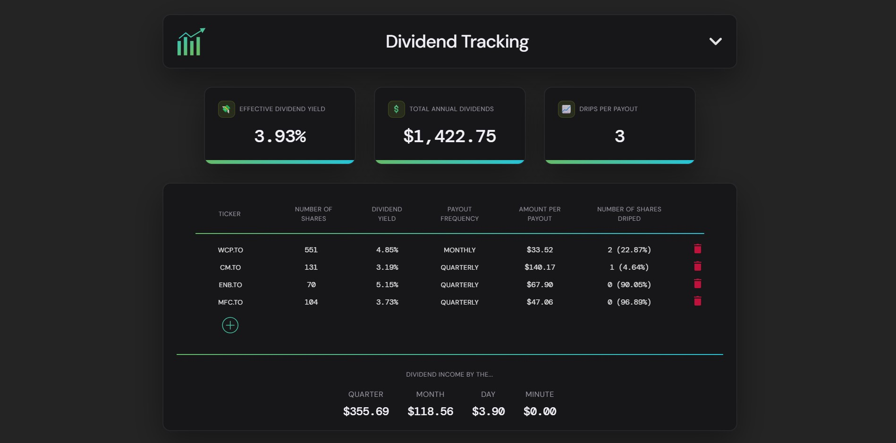

  
Stock Tools

  

A web application that hosts a collection of stock calculation tools I use for managing my personal investments.

> Check it out [here](http://stocktools.joshbacon.ca/)

## Tech Stack
| Layer       | Technology                  |
|-------------|-----------------------------|
| Frontend    | TypeScript, React, Tailwind |
| Backend     | Python, Flask               |

> Market data is pulled using the [yfinance python library](https://pypi.org/project/yfinance/)

## Features

### Growth Tracker
Enter the number of shares you own along with the average cost to see at a glance the total growth as well as a per-stock breakdown.

### Dividend Tracker
Enter the number of shares you own and see your effective dividend yield as well as how much you make in dividends each year, quarter, month, day, and even by the minute.

### Option Calculator
Enter the fees your brokerage charges and details of the contract(s) purchased to find the premium required to breakeven. You can also calculate profit by entering a desired sale premium.
